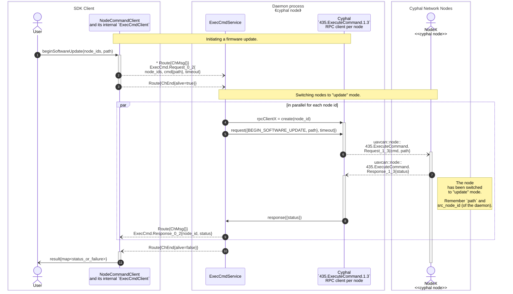
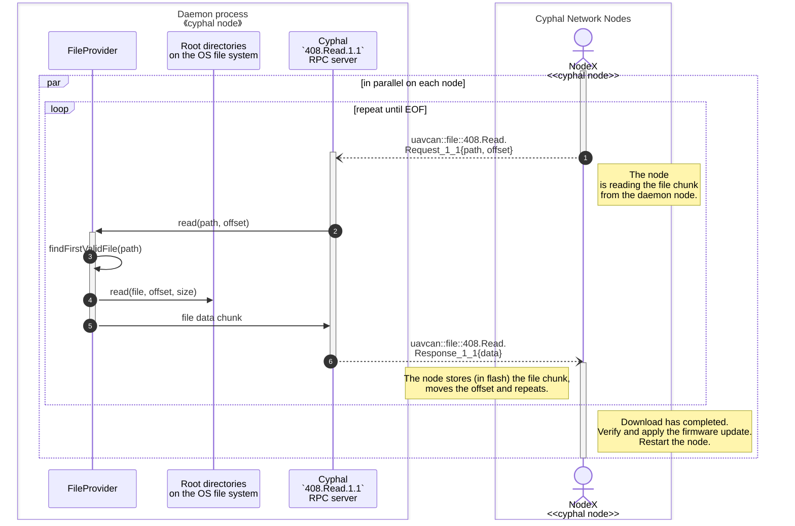

# Firmware Update Sequence diagram

Firmware update scenario consists of two main stages:
- Initiating the firmware update
- Downloading the firmware file

These two stages are almost independent, thought some parameters are passed between them.

## Switching Cyphal nodes to "update" mode

To update the firmware, the nodes must be switched to "update" mode.
This is done by sending the `COMMAND_BEGIN_SOFTWARE_UPDATE` command to each node using the `435.ExecuteCommand` RPC service.
The command triggers a target node to switch to "update" mode and prepare for the firmware update.
As part of the preparation process, the node remembers the path to the firmware file and the source node ID of the daemon that will provide the firmware file.
After that, the firmware updating process runs without any further interaction with the original user, who initiated the update.

Here are descriptions for arrows in the diagram:
1. `User` sends a command to the `NodeCommandClient` to begin the firmware update on the specified nodes, with the specified path to the firmware file.
2. `NodeCommandClient` sends corresponding IPC request(s) to the `ExecCmdService` to build full scope of the update process.
3. `NodeCommandClient` triggers the update process on the remote `ExecCmdService` by marking the end of the channel (with keeping it alive).
4. For each target node id a new Cyphal RTP client is created for standard `435.ExecuteCommand` RPC service.
5. These RTP clients are used to request the command (from step #2) execution on remote target nodes.
6. The command is delivered to the `435.ExecuteCommand` RPC server on target node.
7. The target node confirms the command execution and switches to "update" mode.
The node also remembers the path to the firmware file and the source node id from where the command had arrived -
this information will be used during the next "downloading" stage.
8. The confirmation response is passed back to the `ExecCmdService`. This step will fail with "timeout" if the node is not responding in time.
9. The `ExecCmdService` sends the response back to the `NodeCommandClient`, which collects the results for all nodes.
10. Once we've got responses from all nodes, the `ExecCmdService` sends the channel completion.
11. The `User` receives the overall result of the command execution, which is a map of node ids to their statuses or failures.
Note that even for not responding nodes there will be `Timedout` failure in the map (see step #8).

## Downloading the firmware file

Here are descriptions for arrows in the diagram:
1. A node in "update" mode sends a request to the `408.Read` RPC server on the daemon node to read a chunk of the firmware file.
2. The `408.Read` RPC server forwards the request to the `FileProvider`, which is responsible for reading files from the file system.
3. The `FileProvider` tries to find the requested file in one of the "root" directories.
4. Once the file is found, the `FileProvider` opens and reads the requested chunk of data from the file system.
5. The `FileProvider` sends the data chunk back to the `408.Read` RPC server as a response.
6. The RPC server posts the data chunk back to the node, which stores it in flash memory,
advances the offset, and repeats the process until the end of the file (EOF) is detected.

Once downloading is successfully completed, the node verifies the firmware file and applies the update.
After that, the node restarts and runs the new firmware.
