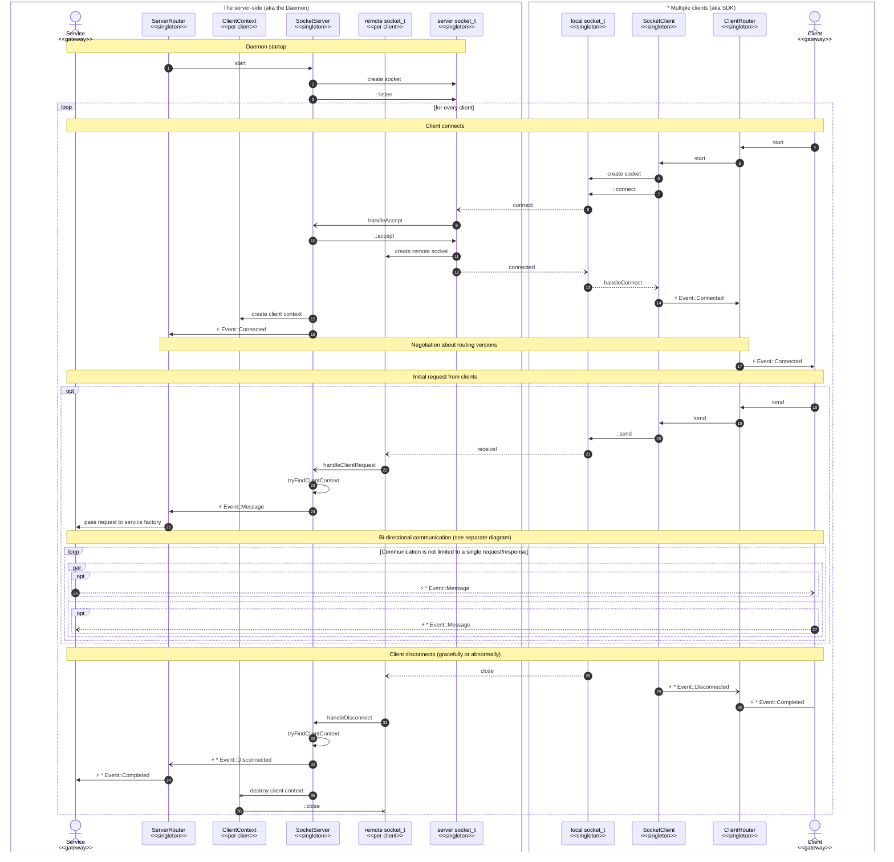
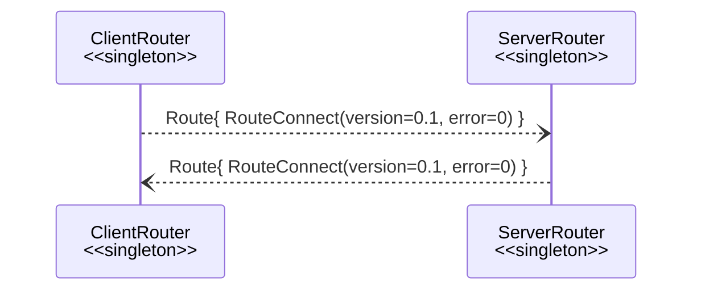

# Inter-Process Communication (IPC) Design

## Establishing IPC Communication sequence diagram

The following diagram illustrates the sequence of events that occur
when a client connects to the server and establishes communication.
The diagram is divided into two sections:
- the server-side (daemon) and the client-side (SDK). The server-side components are represented in a box labeled "The server-side (aka the Daemon)"
- the client-side components are represented in a box labeled "* Multiple clients (aka SDK)."


Here are descriptions for arrows in the diagram:
1. At daemon startup, the `ServerRouter` singleton instance is created, which creates and starts the `SocketServer` "pipe" instance.
2. The `SocketServer` instance creates a server socket and binds it to some address (from the configuration).
3. The server socket starts listening for incoming connections.
4. When an SDK client process starts, it creates a `ClientRouter` instance.
5. The `ClientRouter` instance creates a `SocketClient` "pipe" instance, and starts it.
6. The `SocketClient` instance creates a local socket and binds it the same address as the server.
7. The local socket connects to the server socket, which is listening for incoming connections.
   The connection is asynchronous, so when it is established, the `SocketClient` instance will be notified.
8. The socket connection request reaches the listening server socket. 
   This makes the server socket file descriptor as "readable", which in turn triggers previously registered callback function to be called.
9. The callback function calls the `handleAccept` method of the `SocketServer` instance.
10. The `handleAccept` method accepts incoming connection by calling `::accept`.
11. As a result of the above `::accept` a new socket file descriptor is created, which is the remote socket for the original client socket.
12. Such acceptance is also delivered to the client side, which makes the local socket file descriptor as "writable" and triggers the callback function to be called.
13. The callback function calls the `handleConnect` method of the `SocketClient` instance.
14. The `handleConnect` method notifies the `ClientRouter` instance about the successful connection.
15. Server side then continues by storing the just made remote socket in a new `ClientContext` instance.
These client contexts are stored in a map, which is used later to find the right context for the incoming requests.
16. And finally, the `ServerRouter` instance is notified about the new client connection.
At this point, the client and server will exchange with each other "version negotiation" messages —
to make sure that both parties agree on the same routing protocol version.
Currently, there is no any version check or enforcement, but in the future, it may be possible to have multiple versions of the routing protocol.
17. After successful negotiation, the `ClientRouter` instance notifies the client gateway about the successful connection, so it could start sending requests.
18. The raw data (from the original SDK client) is delivered to the `ClientRouter` instance by prepending the data which extra routing information.
The information is needed at the server side to properly route the request to the right service.
19. The `ClientRouter` instance just passes the data to the `SocketClient` instance as is.
20. The `SocketClient` instance prepends the data with extra header (magic signature and total payload size), and `::send`-s result to the local socket.
21. The above `::send` delivers the data the remote socket, which is the server side of the connection.
22. The remote socket becomes "readable" and triggers the corresponding callback function, which in turn calls `handleClientRequest` method of the `SocketServer` instance.
23. `SocketServer` instance calls `tryFindClientContext` method to find the right client context for the incoming data.
At this point, the diagram is intentionally simplified and does not show the details of how partial data is handled. Also this step validates the header (magic signature) of the incoming data.
24. Once the client context is found, and WHOLE payload was successfully received, the `handleClientRequest` method calls the `ServerRouter` instance and passes the raw data of the request to it.
25. The `ServerRouter` deserializes the routing part of information (see step 18), and passes the remaining payload of the request to a correct service factory (for the initial request),
or to already existing instance of a service channel gateway.
26. At this point, the server side gateway might respond to the corresponding client-side gateway with zero or more messages.
27. Similarly, the client side gateway might send more request messages if needed. Both parties may also indicate that they are done with the communication by sending "completed" messages.
28. If any of the parties disconnects (either normally or abruptly due to a crash), both local and remote socket file descriptors will be notified about the disconnection,
and corresponding callback functions will be called.
29. The `SocketClient` instance will notify the `ClientRouter` instance about the disconnection.
30. The router will pass the completion event to the right client gateway.
31. Similarly, the `SocketServer` will be notified about the disconnection.
32. The `SocketServer` instance will call the `tryFindClientContext` method to find the right client context for the disconnection event.
33. The `ServerRouter` instance will be notified about the disconnection event.
34. The router will pass the completion event to the right service gateway.
35. The `SocketServer` instance will destroy the client context.
36. Destroying the client context will close the remote socket file descriptor.

## Format of message packets

Every message packet consists of a header and a payload.
The header is used to identify the type of message and its length,
while the payload contains the actual data being sent.

### Header

The header is a fixed-size (8 bytes) structure that contains the following fields:
```c++
struct MsgHeader final
{
   std::uint32_t signature{0};
   std::uint32_t payload_size{0};
};
```
- The `signature` field is a magic number that identifies the message type.
It should be equal to `0x5356434F` (aka 'OCVS') for all messages.
- The `payload_size` field is the size of the following payload in bytes. The size does not include the header size.


Every new message reception starts with reading the header.
A failure to read or validate the header will result in yielding an error, which will lead to closing the socket.
- `Disconnected` error is returned on receiving less than expected (8) bytes of the header; zero bytes (aka EOF) are considered as a disconnection;
- `InvalidArgument` error is returned if the header is not valid b/c of:
  - wrong magic signature;
  - payload size is less than one byte;
  - payload size is greater than the maximum allowed size (1MB) — this is a safety check;
- `Other(errno)` error is returned in case of an unexpected system error;

Note, some of the system "errors" are expected ones (e.g. `EAGAIN` or `EINTR`) -
these are handled by retrying the read operation.
Also, reception of less (but >0!) than expected number of bytes is not considered as an error,
but rather a partial read -
it is handled by issuing additional read operations until the expected remaining number of bytes is received.

### Payload

The payload is a variable-size structure that contains the actual data being sent.
A failure to read ALL expected `header.payload_size` bytes of the payload will result in yielding an error,
which will lead to closing the socket.
Similar to the header, partial reads are handled by issuing additional read operations,
until all expected payload bytes are received.
Once the payload is fully received,
it is passed as `io::Payload` (single span of constant bytes) to an upper layer for further processing.
See `SocketBase::receiveData` method for more details.

Received raw payload data represents a serialized `Route`-ing object.
In some cases, the payload may be suffixed with extra raw data.
This is the case when the routing object references another serialized data after it.

## Format of the message routing object

The routing object is a serialized structure that has the following DSDL definition:
```
@union
uavcan.primitive.Empty.1.0 empty
RouteConnect.0.1           connect
RouteChannelMsg.0.1        channel_msg
RouteChannelEnd.0.2        channel_end
@sealed
```
Essentially, this is a union/variant of the following different message types:
- `RouteConnect` - used to establish a connection between the client and the server.
- `RouteChannelMsg` - used to send a message over an established connection.
- `RouteChannelEnd` - used to indicate the end of a channel.

`Empty` - is not in use, but needed to make the union code generation valid (e.g., in case of c++ `variant`).

See Cyphal specification for layout and details of how DSDL types are de/serialized from/to binary data.<br>
Also, the `Nunavut` tool could be used to manually generate C or C++ de/serialization code from a given DSDL file.<br>
Alternatively, you might build this project, and look inside generated `dsdl_transpiled` folders,<br>
e.g., at the `build/src/common/dsdl_transpiled/ocvsmd/common/ipc/*.hpp` header files (see for `serialize` & `deserialize` functions).

### `RouteConnect`

The `RouteConnect` routing type is used to establish a connection between the client and the server.
Normally it is sent by the client to the server as the first message packet after establishing socket connection.
The packet contains the client's version of the routing protocol being used.
The server will respond with the same `RouteConnect` message type back to the client,
delivering the server's version of the protocol.
In the above "Establishing IPC Communication sequence diagram" these packets are represented as
"Negotiation about routing versions" block (see arrows # 16 and 17).

`RouteConnect.0.1` DSDL definition is:
```
uavcan.node.Version.1.0 version
ocvsmd.common.Error.0.1 error
@extent 64 * 8
```
, where
- `version` - is the version of the routing protocol being used (currently `0.1`).
- `error` - optional error code (not in use currently but may be used in the future to reject connection).

Here is a high level sequence diagram of how the `RouteConnect` message is sent and received:


### `RouteChannelMsg`

The `RouteChannelMsg` routing type is used to deliver custom user messages via the established connection.
Normally, there is only one socket connection per client process.
So, the very same connection is used to send multiple messages back and forth,
and communication is not limited to a single request/response.
Moreover, several IPC client/service pairs are communicating over the same connection.

To distinguish between different clients, and properly route and de/multiplex user messages,
the notion of a logical "Channel" exists. Each channel is identified by a unique ID (aka tag).
So, all messages, which belong to the same client/service pair, are sent over the same channel tag.

`RouteChannelMsg.0.1` DSDL definition is:
```
uint64 tag
uint64 sequence
uint64 service_id
uint64 payload_size
@extent 64 * 8
```
, where
- `tag` - is the channel ID of the message; incremented for each new channel created.
- `sequence` - is the sequence number of the message; incremented for each new message sent over the same channel.
- `service_id` - is the ID of the service being called; normally it is a hash of the service name string.
- `payload_size` - is the size of the following payload in bytes.

The `sequence` field is used to identify the order of messages sent over the same channel.
Initially, it's zero. Such initial zero condition is used to detect if the channel is a new or already existing one.

On server-side of IPC (aka `ServerRouter`), if it is a new channel (`sequence == 0`),
the server will create a new channel gateway for it.
`service_id` field is used to locate proper service factory, which was pre-registered under this id.
The located service factory is used to handle the initial request message from the client.
Later channel messages (`sequence > 0`) will be automatically routed to an already existing channel (by `tag`).

Client side of IPC (aka `ClientRouter`) mostly uses the described above `sequence` and `service_id` fields for outgoing messages (aka requests).
Incoming messages (aka responses) are routed to the right channel by its `tag` field (while `sequence` and `service_id` are just logged only).

### `RouteChannelEnd`

The `RouteChannelEnd` routing type is used to indicate the end of the channel communication.
Either side of the IPC may send this message to indicate that it is done sending to the channel,
so the other side may correspondingly react to this fact.

`RouteChannelEnd.0.2` DSDL definition is:
```
uint64 tag
bool keep_alive
ocvsmd.common.Error.0.1 error
@extent 32 * 8
```
, where
- `tag` - is the ID of the channel to be ended.
- `keep_alive` - is a flag indicating whether the channel should be kept alive or not.
- `error` - optional error code (zero for success) to indicate outcome/status/reason of the channel end.

The `keep_alive` field is useful to indicate to the other side of IPC whether the channel has fulfilled its purpose or not.
If `keep_alive` is set to `true`, the channel will be kept alive for further communication.<br>
For example, a client might send multiple messages over the channel to deliver the whole scope of a variable-sized request.
Server accumulates (combines) all these requests until it receives a `RouteChannelEnd` message with `keep_alive` set to `true`.
This will indicate to the server that the client is done sending messages over the channel, and now the server can process the request as a whole.
When the process is done, the server might (optionally) respond with response message(s),
and then send the terminal `RouteChannelEnd` message (`keep_alive == false`).

The `error` field is used to indicate the outcome of the channel end. It's mostly in use for the terminal channel ending,
but a specific client/service may use it (with none zero value) for its own purposes even for "still keep alive" channel.

Note that both client and server IPC routers automatically post a channel terminal end message in case of the channel instance destruction.
For example, consider the following scenario:
1. user creates an IPC client (which implicitly creates a new channel)
2. user makes a request via this channel
3. user releases the last reference to the client (which implicitly destroys the channel) without waiting for the response

As a result of the channel destruction (step # 3), the server will receive a "channel end" notification with `keep_alive == false` and `Cancelled` error.
The corresponding service gateway instance will be notified about the channel end event,
so the service could react to this fact (f.e. by cancelling an operation and releasing associated resources).
Similar story will happen on the client side if the service destroys its channel instance without sending an explicit response or completion first.
