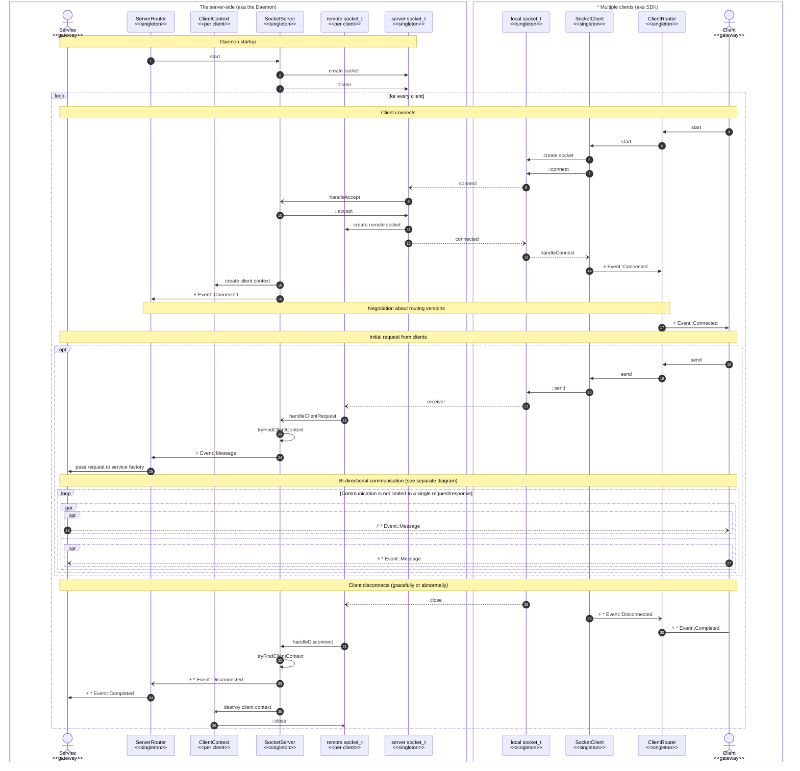

# Inter-Process Communication (IPC) Design

### Establishing IPC Communication sequence diagram

The following diagram illustrates the sequence of events that occur
when a client connects to the server and establishes communication.
The diagram is divided into two sections:
- the server-side (daemon) and the client-side (SDK). The server-side components are represented in a box labeled "The server-side (aka the Daemon)"
- the client-side components are represented in a box labeled "* Multiple clients (aka SDK)."

Here are descriptions for arrows in the diagram:
1. At daemon startup, the `ServerRouter` singleton instance is created, which creates and starts the `SocketServer` "pipe" instance.
2. The `SocketServer` instance creates a server socket and binds it to some address (from the configuration).
3. The server socket starts listening for incoming connections.
4. When an SDK client process starts, it creates a `ClientRouter` instance.
5. The `ClientRouter` instance creates a `SocketClient` "pipe" instance, and starts it.
6. The `SocketClient` instance creates a local socket and binds it the same address as the server.
7. The local socket connects to the server socket, which is listening for incoming connections.
   The connection is asynchronous, so when it is established, the `SocketClient` instance will be notified.
8. The socket connection request reaches the listening server socket. 
   This makes the server socket file descriptor as "readable", which in turn triggers previously registered callback function to be called.
9. The callback function calls the `handleAccept` method of the `SocketServer` instance.
10. The `handleAccept` method accepts incoming connection by calling `::accept`.
11. As a result of the above `::accept` a new socket file descriptor is created, which is the remote socket for the original client socket.
12. Such acceptance is also delivered to the client side, which makes the local socket file descriptor as "writable" and triggers the callback function to be called.
13. The callback function calls the `handleConnect` method of the `SocketClient` instance.
14. The `handleConnect` method notifies the `ClientRouter` instance about the successful connection.
15. Server side then continues by storing the just made remote socket in a new `ClientContext` instance.
These client contexts are stored in a map, which is used later to find the right context for the incoming requests.
16. And finally, the `ServerRouter` instance is notified about the new client connection.
At this point, the client and server will exchange with each other "version negotiation" messages —
to make sure that both parties agree on the same routing protocol version.
Currently, there is no any version check or enforcement, but in the future, it may be possible to have multiple versions of the routing protocol.
17. After successful negotiation, the `ClientRouter` instance notifies the client gateway about the successful connection, so it could start sending requests.
18. The raw data (from the original SDK client) is delivered to the `ClientRouter` instance by prepending the data which extra routing information.
The information is needed at the server side to properly route the request to the right service.
19. The `ClientRouter` instance just passes the data to the `SocketClient` instance as is.
20. The `SocketClient` instance prepends the data with extra header (magic signature and total payload size), and `::send`-s result to the local socket.
21. The above `::send` delivers the data the remote socket, which is the server side of the connection.
22. The remote socket becomes "readable" and triggers the corresponding callback function, which in turn calls `handleClientRequest` method of the `SocketServer` instance.
23. `SocketServer` instance calls `tryFindClientContext` method to find the right client context for the incoming data.
At this point, the diagram is intentionally simplified and does not show the details of how partial data is handled. Also this step validates the header (magic signature) of the incoming data.
24. Once the client context is found, and WHOLE payload was successfully received, the `handleClientRequest` method calls the `ServerRouter` instance and passes the raw data of the request to it.
25. The `ServerRouter` deserializes the routing part of information (see step 18), and passes the remaining payload of the request to a correct service factory (for the initial request),
or to already existing instance of a service channel gateway.
26. At this point, the server side gateway might respond to the corresponding client-side gateway with zero or more messages.
27. Similarly, the client side gateway might send more request messages if needed. Both parties may also indicate that they are done with the communication by sending "completed" messages.
28. If any of the parties disconnects (either normally or abruptly due to a crash), both local and remote socket file descriptors will be notified about the disconnection,
and corresponding callback functions will be called.
29. The `SocketClient` instance will notify the `ClientRouter` instance about the disconnection.
30. The router will pass the completion event to the right client gateway.
31. Similarly, the `SocketServer` will be notified about the disconnection.
32. The `SocketServer` instance will call the `tryFindClientContext` method to find the right client context for the disconnection event.
33. The `ServerRouter` instance will be notified about the disconnection event.
34. The router will pass the completion event to the right service gateway.
