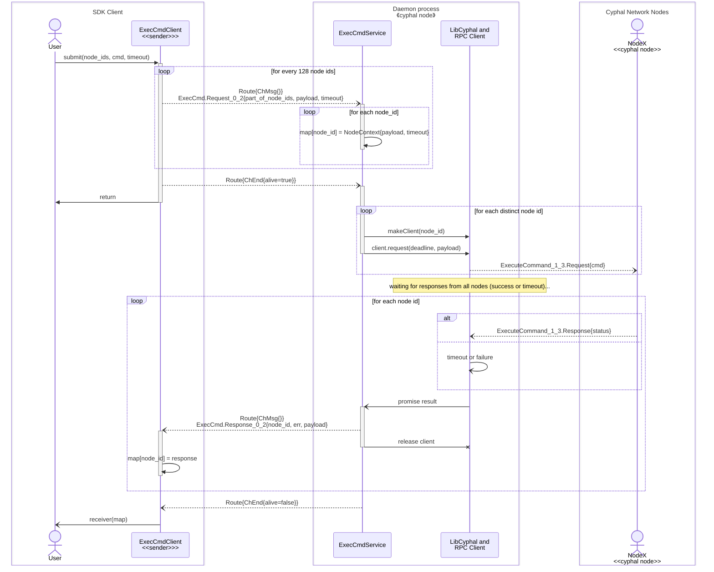
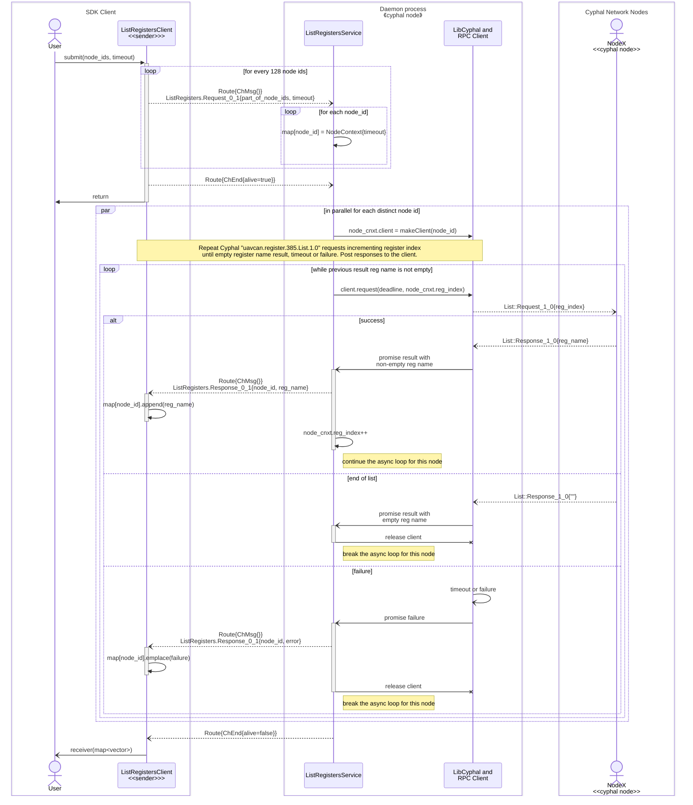
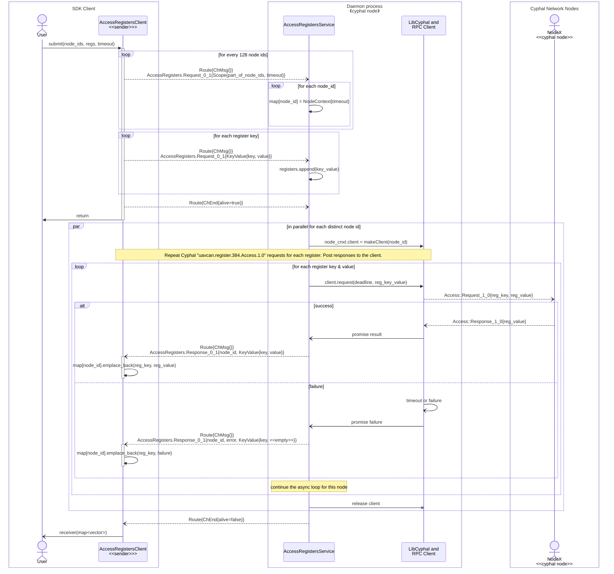
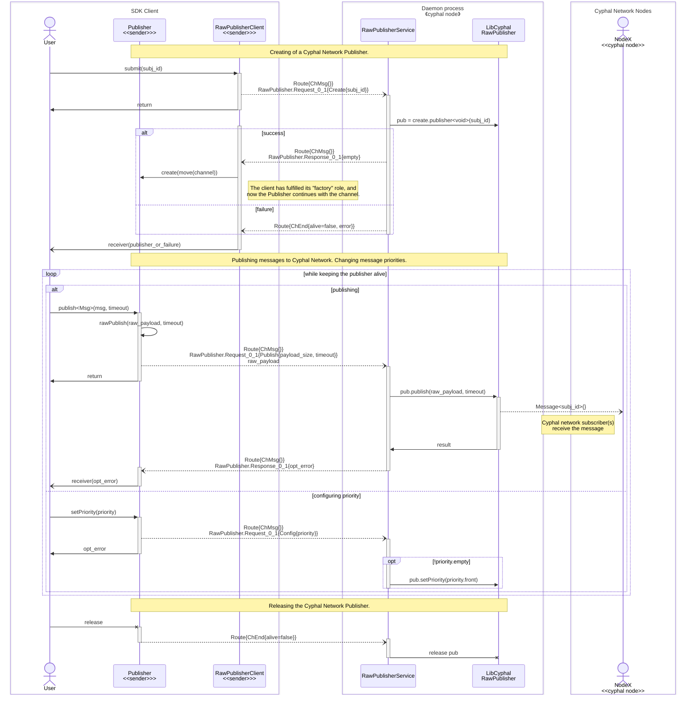
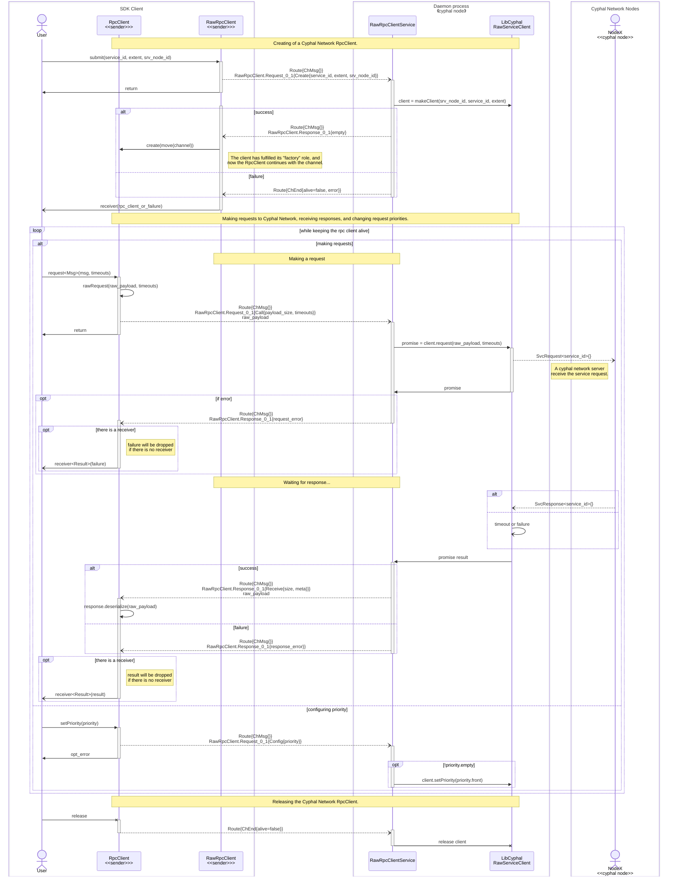
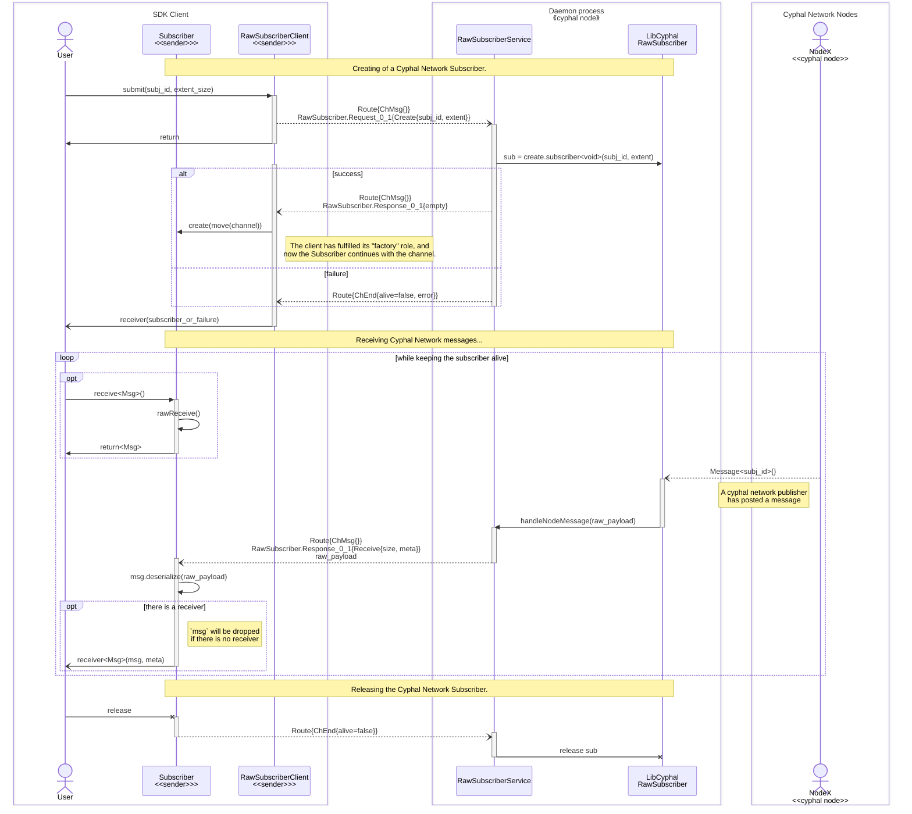
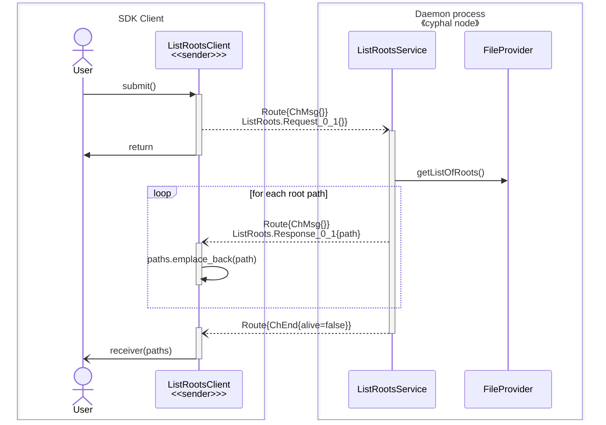
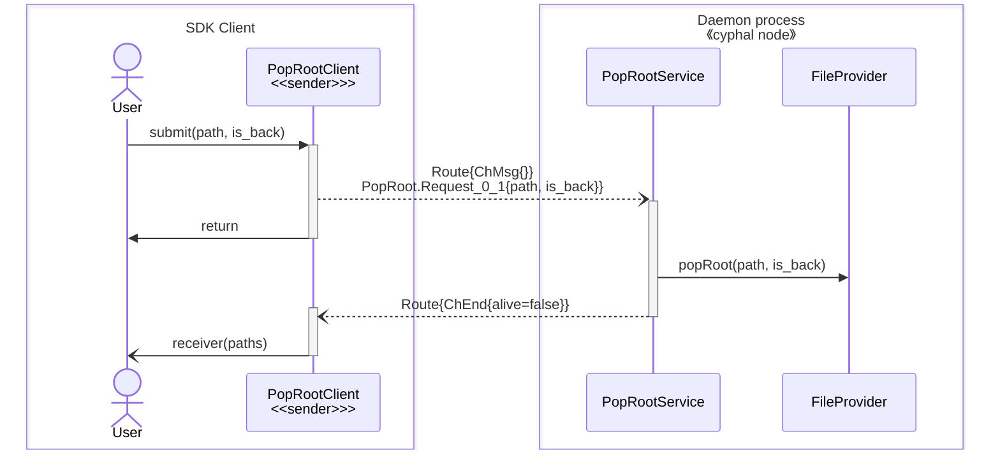
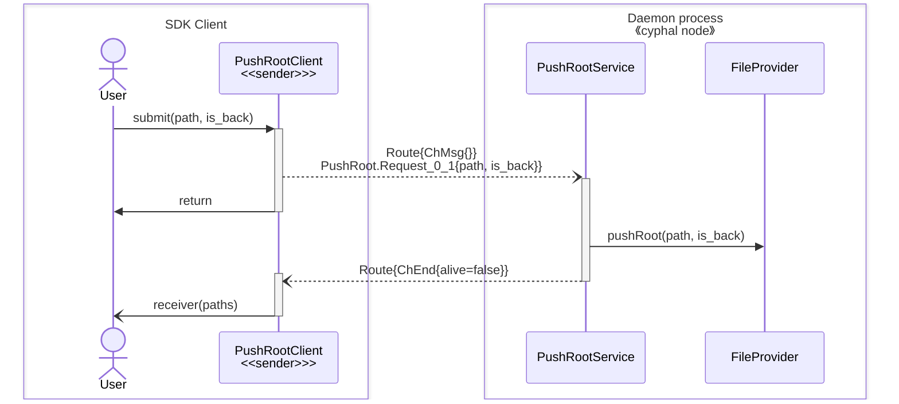

Services Design
==============

This document describes IPC contracts between various clients and corresponding services of the OCVSMD.

- [Services Design](#services-design)
- [Node services](#node-services)
  - [`ExecCmd`](#execcmd)
  - [`ListRegisters`](#listregisters)
  - [`AccessRegisters`](#accessregisters)
- [Relay services](#relay-services)
  - [`RawPublisher`](#rawpublisher)
  - [`RawRpcClient`](#rawrpcclient)
  - [`RawSubscriber`](#rawsubscriber)
- [File Server services](#file-server-services)
  - [`ListRoots`](#listroots)
  - [`PopRoot`](#poproot)
  - [`PushRoot`](#pushroot)

# Node services

## `ExecCmd`

**DSDL definitions:**
- `ExecCmd.0.2.dsdl`
```
uint64 timeout_us
uint16[<=128] node_ids
UavcanNodeExecCmdReq.0.1 payload
@extent 600 * 8
---
ocvsmd.common.Error.0.1 error
uint16 node_id
UavcanNodeExecCmdRes.0.1 payload
@extent 128 * 8
```

**Sequence diagram**


## `ListRegisters`

**DSDL definitions:**
- `ListRegisters.0.1.dsdl`
```
uint64 timeout_us
uint16[<=128] node_ids
@extent 600 * 8
---
ocvsmd.common.Error.0.1 error
uint16 node_id
uavcan.register.Name.1.0 item
@extent 600 * 8
```

**Sequence diagram**


## `AccessRegisters`

**DSDL definitions:**
- `AccessRegisters.0.1.dsdl`
```
@union
uavcan.primitive.Empty.1.0 empty
AccessRegistersScope.0.1 scope
AccessRegistersKeyValue.0.1 register
@sealed
---
ocvsmd.common.Error.0.1 error
uint16 node_id
AccessRegistersKeyValue.0.1 register
@extent 700 * 8
```
- `AccessRegistersScope.0.1.dsdl`
```
uint64 timeout_us
uint16[<=128] node_ids
@extent 600 * 8
```
- `AccessRegistersKeyValue.0.1.dsdl`
```
uavcan.register.Name.1.0 key
uavcan.register.Value.1.0 value
@extent 600 * 8
```

**Sequence diagram**


# Relay services

## `RawPublisher`

**DSDL definitions:**
- `RawPublisher.0.1.dsdl`
```
@union
uavcan.primitive.Empty.1.0 empty
RawPublisherCreate.0.1 create
RawPublisherConfig.0.1 config
RawPublisherPublish.0.1 publish
@sealed
---
@union
uavcan.primitive.Empty.1.0 empty
ocvsmd.common.Error.0.1 publish_error
@sealed
```
- `RawPublisherCreate.0.1.dsdl`
```
uint16 subject_id
@extent 16 * 8
```
- `RawPublisherConfig.0.1.dsdl`
```
uint8[<=1] priority
@extent 32 * 8
```
- `RawPublisherPublish.0.1.dsdl`
```
uint64 timeout_us
uint64 payload_size
@extent 32 * 8
```

**Sequence diagram**


## `RawRpcClient`

**DSDL definitions:**
- `RawRpcClient.0.1.dsdl`
```
@union
uavcan.primitive.Empty.1.0 empty
RawRpcClientCreate.0.1 create
RawRpcClientConfig.0.1 config
RawRpcClientCall.0.1 call
@sealed
---
@union
uavcan.primitive.Empty.1.0 empty
RawRpcClientReceive.0.1 receive
ocvsmd.common.Error.0.1 error
@sealed
```
- `RawRpcClientCreate.0.1.dsdl`
```
uint64 extent_size
uint16 service_id
uint16 server_node_id
@extent 32 * 8
```
- `RawRpcClientConfig.0.1.dsdl`
```
uint8[<=1] priority
@extent 32 * 8
```
- `RawRpcClientCall.0.1.dsdl`
```
uint64 request_timeout_us
uint64 response_timeout_us
uint64 payload_size
@extent 64 * 8
```
- `RawRpcClientReceive.0.1.dsdl`
```
uint8 priority
uint16 remote_node_id
uint64 payload_size
@extent 32 * 8
```

**Sequence diagram**


## `RawSubscriber`

**DSDL definitions:**
- `RawSubscriber.0.1.dsdl`
```
@union
uavcan.primitive.Empty.1.0 empty
RawSubscriberCreate.0.1 create
@sealed
---
@union
uavcan.primitive.Empty.1.0 empty
RawSubscriberReceive.0.1 receive
@sealed
```
- `RawSubscriberCreate.0.1.dsdl`
```
uint64 extent_size
uint16 subject_id
@extent 32 * 8
```
- `RawSubscriberReceive.0.1.dsdl`
```
uint8 priority
uint16[<=1] remote_node_id
uint64 payload_size
@extent 64 * 8
```

**Sequence diagram**


# File Server services

## `ListRoots`

**DSDL definitions:**
- `ListRoots.0.1.dsdl`
```
@extent 512 * 8
---
uavcan.file.Path.2.0 item
@extent 512 * 8
```

**Sequence diagram**


## `PopRoot`

**DSDL definitions:**
- `PopRoot.0.1.dsdl`
```
uavcan.file.Path.2.0 item   # The path to the root directory to be pop from the list of roots.
bool is_back                # Determines whether the path is searched from the front or the back of the list.
@extent 512 * 8
---
@extent 512 * 8
```

**Sequence diagram**


## `PushRoot`

**DSDL definitions:**
- `PushRoot.0.1.dsdl`
```
uavcan.file.Path.2.0 item   # The path to the root directory to be pushed into the list of roots.
bool is_back                # Determines whether the path is searched from the front or the back of the list.
@extent 512 * 8
---
@extent 512 * 8
```

**Sequence diagram**

