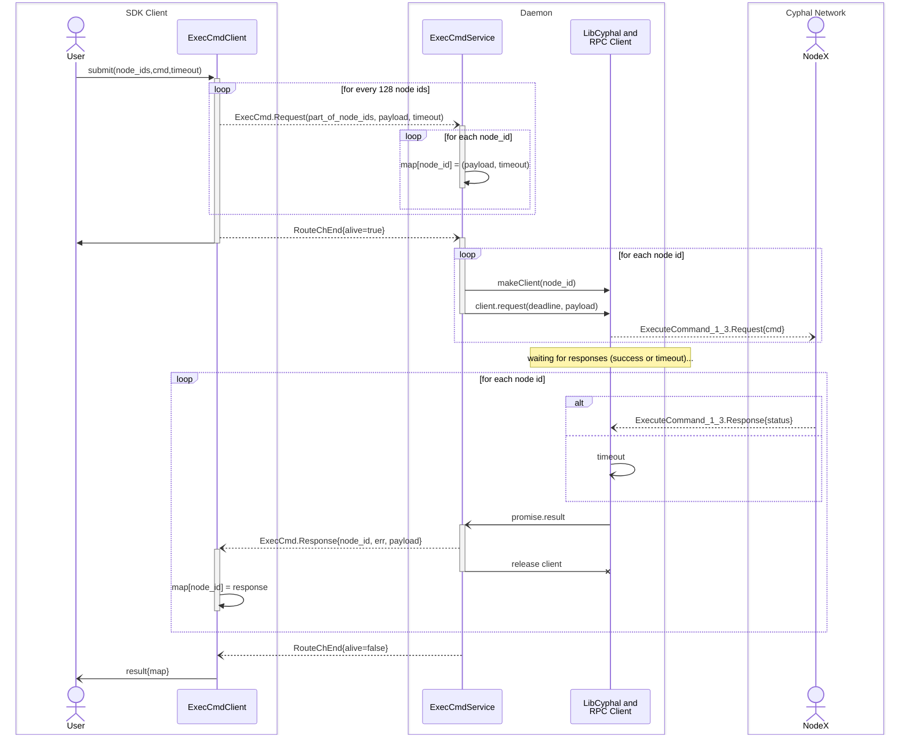

# Services Design

This document describes IPC contracts between various clients and corresponding services of the OCVSMD.

## Node services

### `ExecCmd` service

#### DSDL definitions

##### `ExecCmd.0.2.dsdl`
```
uint64 timeout_us
uint16[<=128] node_ids
UavcanNodeExecCmdReq.0.1 payload
@extent 600 * 8
---
ocvsmd.common.Error.0.1 error
uint16 node_id
UavcanNodeExecCmdRes.0.1 payload
@extent 128 * 8
```
#### Sequence diagram


### `ListRegisters`

### `AccessRegisters`

## Relay services

### `RawPublisher`

### `RasSubscriber`

## File Server services

### `ListRoots`

### `PopRoot`

### `PushRoot`
